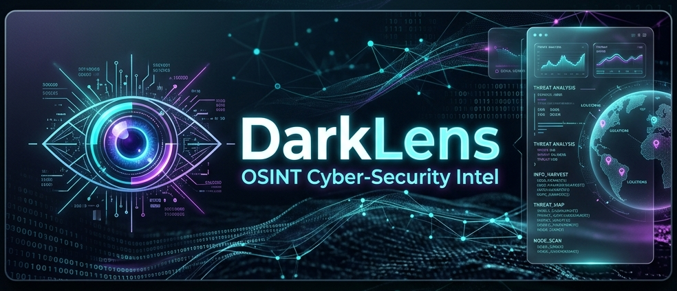

<p align="center">
  
</p>

# DarkLens OSINT Platform

DarkLens is an enterprise-grade, high-fidelity threat intelligence and reconnaissance platform. It allows security researchers to maintain persistent, authenticated access to dark web forums, surface intelligence sources, and Telegram channels without the friction of repeated logins.

## Key Features

- **Frictionless Authentication (Playwright + Chromium):** Launch an authenticated browsing session instantly. The platform injects saved session cookies and local storage directly into a sandboxed Chromium instance, enabling immediate access to gated forums.
- **In-Browser Capture HUD:** DarkLens injects a discreet floating action button (FAB) directly into your research sessions. Instantly capture full-page context, grab screenshots, or update your authentication state without leaving the target site.
- **Intelligence Scratchpad (Markdown):** A robust threat intelligence note-taking system. Write full Markdown documentation, track target IOCs, and tag identities.
- **Continuous Infrastructure Monitoring (DNS):** A background polling engine runs every 5 minutes to track the infrastructure (A, NS, MX, TXT records) of all monitored targets. Shifts in proxies or hosting are logged historically.
- **Native Telegram MTProto Integration:** Connect directly to the Telegram network using MTProto to bypass scraping blocks and pull live intelligence from private groups and channels seamlessly.
- **Onion & Surface Support:** Targets can be configured with dual URLs (Surface and Onion). The launcher automatically routes `.onion` traffic through a local Tor proxy (`127.0.0.1:9050`) while using standard Chromium to retain access to native translation features.

## Getting Started

### Prerequisites
- **Node.js** (v18+)
- **MongoDB** (Local or Atlas)
- **Tor Service** (Running on port 9050 for `.onion` access)
- **Google Chrome / Chromium** (Installed locally for Playwright)

### Installation

1. **Clone the repository:**
   ```bash
   git clone https://github.com/your-org/DarkLens.git
   cd DarkLens
   ```

2. **Configure Environment:** Create a `.env` in the root directory.
   ```env
   MONGO_URI=mongodb://127.0.0.1:27017/darklens
   PORT=5000
   SESSION_SECRET=your_secure_secret
   API_KEY=your_api_key
   ```

3. **Install Dependencies & Start:**
   Use the provided startup script which automatically installs dependencies for both frontend and backend and starts the application.
   ```bash
   chmod +x start.sh
   ./start.sh
   ```

### Architecture
- **Frontend:** React, Vite, Lucide Icons, Glassmorphism UI
- **Backend:** Node.js, Express, MongoDB/Mongoose
- **Engines:** Playwright (Web), MTProto/GramJS (Telegram), Node-Cron (DNS)

## Disclaimer
This tool is built strictly for authorized security research, OSINT gathering, and threat intelligence analysis. Usage for malicious purposes is strictly prohibited.
